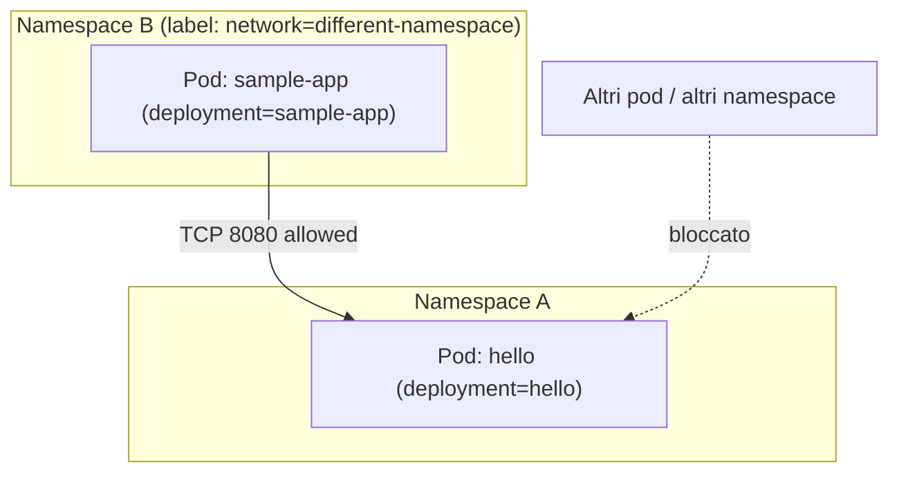

# Obiettivi delle NetworkPolicy

In OpenShift/Kubernetes, le **NetworkPolicy** permettono di controllare il traffico di rete a livello di pod.  
Vediamo l’obiettivo delle due policy fornite.

---

## 1) NetworkPolicy: `deny-all`

```yaml
kind: NetworkPolicy
apiVersion: networking.k8s.io/v1
metadata:
  name: deny-all
spec:
  podSelector: {}
```

### Obiettivo
- Questa policy **nega tutto il traffico in ingresso a tutti i pod** nel namespace.  
- L’uso di `podSelector: {}` significa *seleziona tutti i pod*.  
- Poiché non è specificata alcuna regola `ingress`, l’effetto è che **nessun pod può ricevere traffico in ingresso** (comportamento di default: *deny all*).  

In altre parole, è una policy di **baseline** che blocca tutto il traffico in ingresso.  
Da sola renderebbe i pod irraggiungibili.  

---

## 2) NetworkPolicy: `allowed-specific`

```yaml
spec:
  podSelector:
    matchLabels:
      deployment: hello
  ingress:
    - from:
      - namespaceSelector:
          matchLabels:
            network: different-namespace
        podSelector:
          matchLabels:
            deployment: sample-app
      ports:
      - port: 8080
        protocol: TCP
```

### Obiettivo
- Questa policy **seleziona i pod etichettati** con `deployment: hello`.  
- Consente traffico **solo in ingresso** da:  
  - Pod etichettati con `deployment: sample-app`,  
  - situati in un namespace che ha l’etichetta `network: different-namespace`.  
- Il traffico consentito è **solo sulla porta TCP 8080**.  

In altre parole:  soltanto i pod `sample-app` di un namespace specifico possono raggiungere i pod `hello` sulla porta 8080.  
Tutto il resto viene bloccato (grazie anche alla deny-all baseline).

---

## Diagramma 



---

## Sintesi
- `deny-all`: blocca tutto il traffico in ingresso per impostazione predefinita.  
- `allowed-specific`: riapre solo ciò che serve, consentendo un flusso mirato (pod `sample-app` → pod `hello` sulla porta 8080).  
