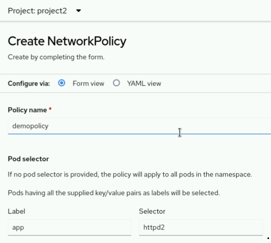
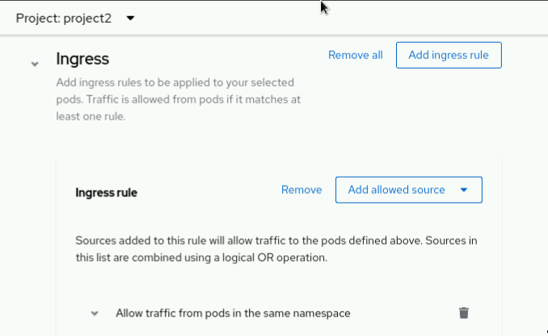
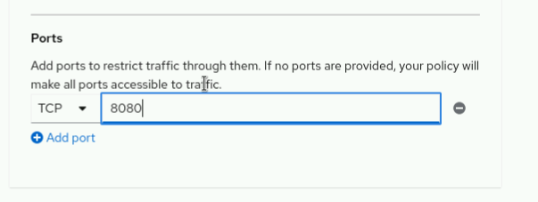

## Creazione dei Progetti e Deployment

```sh
oc new-project project1

oc create deployment --image=registry.ocp4.example.com:8443/ubi8/httpd-24:latest httpd1

oc new-project project2

oc create deployment --image=registry.ocp4.example.com:8443/ubi8/httpd-24:latest httpd2
```

## Recupero degli IP dei Pod

```sh
IP1=$(oc get pods -o jsonpath='{range .items[*]}{.status.podIP}{"\n"}{end}' -n project1)
IP2=$(oc get pods -o jsonpath='{range .items[*]}{.status.podIP}{"\n"}{end}' -n project2)
```

## Recupero dei Nome dei Pod

```sh
oc project project1

POD1=$(oc get pods -o jsonpath='{.items[0].metadata.name}' -n project1)
POD2=$(oc get pods -o jsonpath='{.items[0].metadata.name}' -n project2)
```

## Test di Connessione tra i Pod

```sh
# OK: Il pod di project1 può contattare il pod di project2
oc exec -n project1 $POD1 -- curl -s http://$IP2:8080

# OK: Il pod di project2 può contattare il pod di project1
oc exec -n project2 $POD2 -- curl -s http://$IP1:8080
```

## Visualizzazione delle Etichette dei Pod

```sh
oc get pods --show-labels -n project1  # app=httpd1
oc get pods --show-labels -n project2  # app=httpd2
```

## Creazione di una Network Policy da Console Web

Creare una **Network Policy** su `project2` con **target** `app=httpd2` e **allow** solo dai pod nello stesso namespace.





   
Verificare la connettività:

```sh
# KO: Il pod di project1 non può più raggiungere il pod di project2
oc exec -n project1 $POD1 -- curl -s http://$IP2:8080

# OK: Il pod di project2 può ancora contattare il pod di project1
oc exec -n project2 $POD2 -- curl -s http://$IP1:8080
```

## Aggiunta di una nuova Network Policy per Consentire Accesso da app=httpd1

1. Aggiungi una **Network Policy** su `project2` per consentire connessioni da pod nel cluster con `app=httpd1`.
2. Verificare nuovamente la connettività:

```sh
# OK: Il pod di project1 può ora raggiungere il pod di project2
oc exec -n project1 $POD1 -- curl -s http://$IP2:8080

# OK: Il pod di project2 può ancora contattare il pod di project1
oc exec -n project2 $POD2 -- curl -s http://$IP1:8080
```

## Network policies vs firewalls

* Le OpenShift NetworkPolicies sono additive

- Servono solo per consentire il traffico; non bloccano esplicitamente.
- Se qualsiasi policy permette il traffico, allora è consentito.
- Se nessuna policy permette il traffico, viene bloccato (modello deny-by-default).

I firewall Linux (iptables/firewalld) usano il principio "first-match-wins" o regole ordinate

- Le regole vengono valutate in ordine (iptables le processa dall’alto verso il basso).
- Se una regola DROP viene trovata prima di una ACCEPT, il traffico viene bloccato.
- Se una regola ACCEPT viene trovata prima di una DROP, il traffico è consentito.

### Conclusione:

- Nelle OpenShift NetworkPolicies, la policy più permissiva prevale.
- Nei firewall Linux, prevale la prima regola corrispondente (l'ordine è fondamentale).
