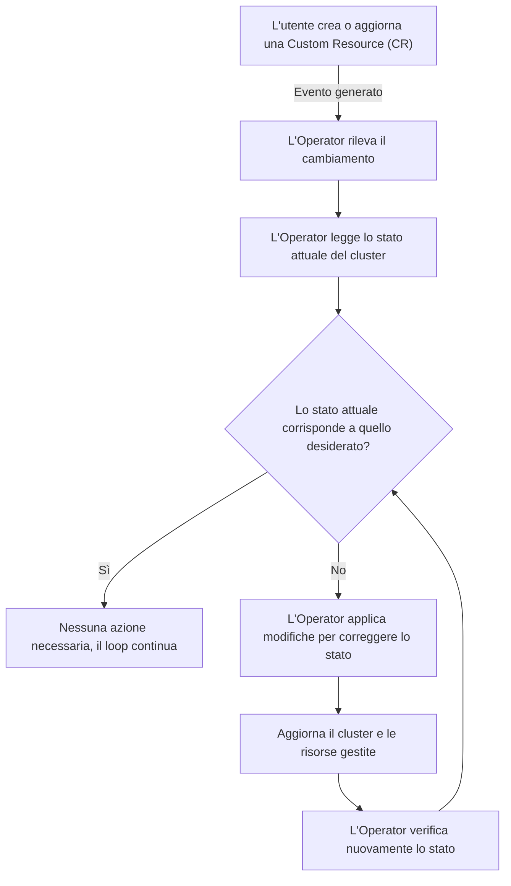

# 📌 Processo di Reconciliation negli OpenShift Operators

## 🔹 Introduzione
Nel contesto degli **Operators** in OpenShift/Kubernetes, il **meccanismo di Reconciliation** assicura che lo stato attuale del cluster sia sempre allineato con lo stato desiderato dichiarato dall’utente.

Il processo segue un ciclo continuo che verifica le risorse nel cluster e le corregge se necessario.

---

## 🔹 Diagramma del processo

---

## 🔹 Spiegazione del processo
1️⃣ **L’utente crea o aggiorna una Custom Resource (CR)**  
   - Esempio: Creazione di un `PostgreSQLCluster` con 3 repliche.  

2️⃣ **Viene generato un evento** che notifica l’Operator del cambiamento.

3️⃣ **L’Operator legge lo stato attuale del cluster**
   - Controlla se le risorse sono conformi alla richiesta.

4️⃣ **Confronto tra stato attuale e stato desiderato**
   - Se il cluster è già conforme → **nessuna azione necessaria**.
   - Se ci sono discrepanze → **l’Operator applica le modifiche**.

5️⃣ **L’Operator corregge lo stato**
   - Esempio: Se il database ha meno di 3 repliche, ne crea altre.

6️⃣ **Verifica dello stato aggiornato**
   - Se lo stato è corretto, il loop continua a monitorare il sistema.

---

## 🔹 Conclusione
✅ Il meccanismo di **Reconciliation** è fondamentale per mantenere l'integrità del cluster.  
✅ Funziona tramite un **loop continuo**, rilevando e correggendo eventuali discrepanze.  
✅ Gli **Operators** sono progettati per automatizzare la gestione delle applicazioni e delle risorse.  

💡 **Pensa agli Operators come “robot amministratori” che mantengono il cluster sempre in ordine!** 🤖🔧
