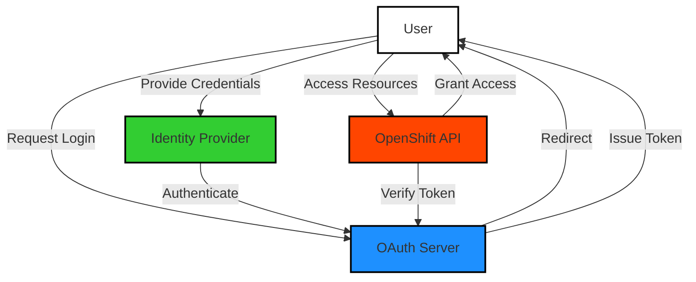

# Flusso di Funzionamento:

* L'utente accede a un'applicazione e viene reindirizzato all'OAuth Server per autenticarsi.
* L'OAuth Server reindirizza l'utente all'Identity Provider per inserire le credenziali.
* Dopo l'autenticazione, l'Identity Provider comunica l'esito all'OAuth Server.
* L'OAuth Server emette un token di accesso e lo restituisce all'utente.
* L'utente utilizza il token per effettuare richieste all'API di OpenShift.
* L'API verifica il token con l'OAuth Server prima di concedere l'accesso.
